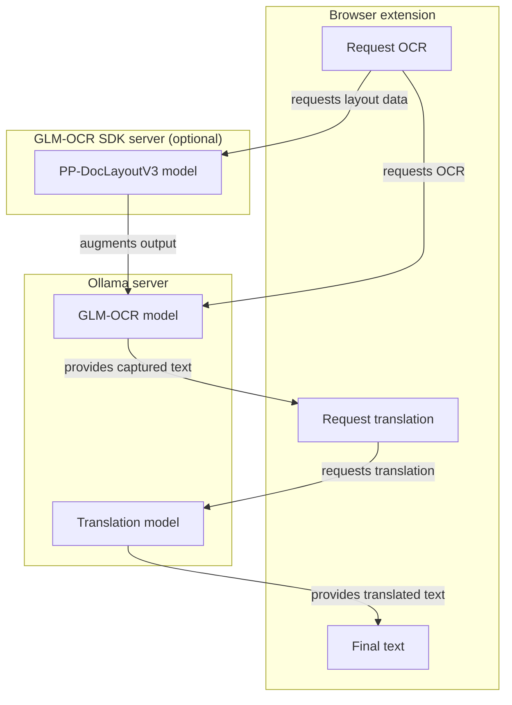

# Visibabel

Local OCR and translation for your browser. Visibabel captures images from web pages, runs OCR through [GLM-OCR](https://huggingface.co/zai-org/GLM-OCR), and optionally augments results with layout data from a companion Python service.

## Core modules

| Module            | Path                       | Role                                                               |
| ----------------- | -------------------------- | ------------------------------------------------------------------ |
| Browser extension | [`extension/`](extension/) | MV3 Chrome extension for capture, OCR, translation, and results UI |
| GLM-OCR service   | [`glm-ocr/`](glm-ocr/)     | FastAPI service for layout-aware OCR augmentation                  |

Shared dev tooling lives in [`ollama/`](ollama/) (launcher scripts and endpoint smoke tests).

## Architecture



## Prerequisites

- LLM server API running `glm-ocr:latest`
- Node.js 20+
- Python 3.12+
- Google Chrome for extension development

## Quick start

### Docker compose (alternative to steps 1–3)

Requires [Docker](https://docs.docker.com/get-docker/) with Compose.

```bash
docker compose up -d --build
```

This starts Ollama (`localhost:11434`) and the GLM-OCR layout service (`localhost:5002`) using the official `ollama/ollama` image. Models are pulled automatically:

- `glm-ocr:latest` — OCR (Z.ai [GLM-OCR](https://huggingface.co/zai-org/GLM-OCR)))
- `kaelri/hy-mt2:1.8b` — translation (Tencent [Hy-MT2-1.8B](https://huggingface.co/tencent/Hy-MT2-1.8B))

Verify:

```bash
curl http://localhost:5002/health
curl http://localhost:11434/api/tags
```

The extension defaults (`http://localhost:11434/`, layout on port `5002`) work without changes. The glm-ocr container reaches Ollama via Docker service DNS using `GLMOCR_OLLAMA_ENDPOINT=http://ollama:11434` (set in `docker-compose.yml`). The first layout OCR request may download the Hugging Face layout model into the `glm_ocr_models` Docker volume.

---

### 1. Pull the OCR & translation models

```bash
ollama pull glm-ocr:latest
ollama pull kaelri/hy-mt2:1.8b
```

### 2. Start Ollama

Windows:

```powershell
npm --prefix ./ollama run start:ollama
```

Linux/macOS:

```bash
./ollama/start-ollama.sh
```

### 3. Start the GLM-OCR service

Windows:

```powershell
cd glm-ocr
.\run-service.ps1
```

Linux/macOS:

```bash
cd glm-ocr
./run-service.sh
```

Service health: `http://localhost:5002/health`

### 4. Build and load the extension

```bash
cd extension
npm install
npm run build:extension
```

Load the unpacked extension from the `extension/` folder in Chrome. Set the Ollama endpoint in the options page (default: `http://localhost:11434/`).

## Testing

See [`README.TESTS.md`](README.TESTS.md) for the full test matrix.

Quick checks:

```bash
npm --prefix ./extension run test:unit
npm --prefix ./ollama run test:negative
pytest glm-ocr
```

## Documentation

- [`docs/ENDPOINT_API_REFERENCE.md`](docs/ENDPOINT_API_REFERENCE.md) — HTTP API for Ollama and GLM-OCR endpoints
- [`extension/README.md`](extension/README.md) — extension development
- [`glm-ocr/README.md`](glm-ocr/README.md) — Python service setup
- [`ollama/README.md`](ollama/README.md) — Ollama dev tooling

## License

MIT
